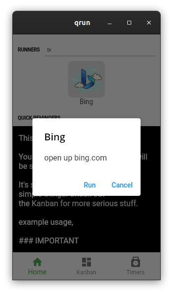
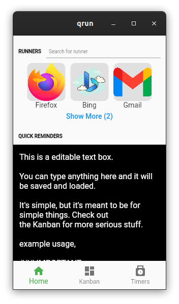
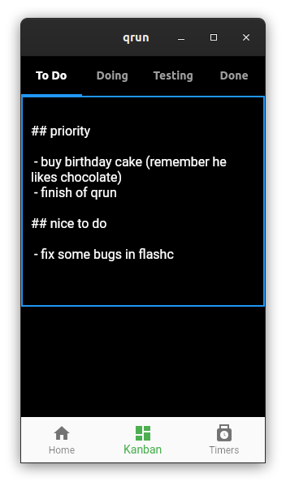
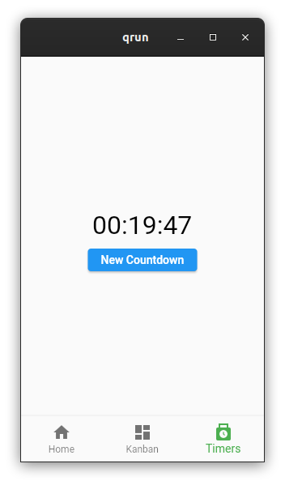

# qrun

A 'quick' command runner + extra productivity tools.

## # commands

Simple python scripts that will be runnable through the app via a few click.

All the config and relevant data can be found in your home/documents directory, in a folder called qrun_config.

qrun_config will have a runners.json file like this,


```
{
  "runners" : [
    {
    "title" : "Firefox",
    "runner" : "firefox.py",
    "arguments" : "",
    "description" : "start up firefox on click",
    "icon" : "firefox.png"
    },
    {
    "title" : "Bing",
    "runner" : "edge.py",
    "arguments" : "https://www.bing.com",
    "description" : "open up bing.com",
    "icon" : "bing-100.png"
    },
  ]
}
```

runners must be python scripts and must be in the qrun_config/runners folder.

icons must be in qrun_config/icons folder.

TODO: might make a mobile version eventually, but one that sticks to opening websites for now.







